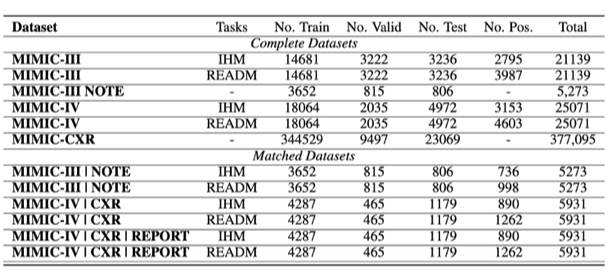

## Code for [CM$^2$](-): Cross-Modal Alignment via Variational Copula Modelling


Table of contents
=================

<!--ts-->
- [Table of contents](#table-of-contents)
- [Background](#background)
- [Overview of the CM$^2$ network](#overview-of-the-cm2-network)
- [Environment setup](#environment-setup)
  - [Dataset](#dataset)
- [Overview of the network with CM$^2$ module](#overview-of-the-network-with-cm2-module)
  - [Model training](#model-training)
  - [Model evaluation](#model-evaluation)
- [Citation](#citation)
   
<!--te-->

Background
============
Multimodal learning aims to aggregate information from multiple modalities to generate meaningful representations for downstream tasks.The key challenge in multimodal learning is how to appropriately align the representations of respective modalities and fuse them into a joint distribution. Existing methods mainly focus on fusing the representations via concatenation or Kronecker product which over-simplify the interaction structure between modalities, prompting the need to model the complex interactions. On the other hand, the notion of joint distribution of the latent representations, which incorporates higher-order interactions between modalities, has been under-explored. Copula is a powerful statistical structure in modeling the interactions between variables as it bridges the joint distribution and the marginal distributions of multiple variables.


Overview of the CM$^2$ network
====================================

We first extract and link the datasets from MIMIC-IV, MIMIC-III and MIMIC-CXR based on the task definition (i.e., in hospital mortality prediction, or readmission prediction). The data splits of the training, validation, and test sets are summarized for each task, and the prevalence of positive and negative labels for in-hospital mortality and readmission is shown in 



Environment setup
==================

    git clone xxx
    cd CMCM
    conda env create -f environment.yml
    conda activate CMCM

Dataset
-------------

We used [MIMIC-IV EHR](https://physionet.org/content/mimiciv/2.2/), [MIMIC CXR IMAGE](https://physionet.org/content/mimic-cxr-jpg/2.0.0/) and [MIMIC CXR REPORT](https://physionet.org/content/mimic-cxr/2.1.0/) for MIMIC-IV experiments on bi-modal(EHR time-series and CXR image) and tri-model(EHR time-series, CXR image and radiology report) settings.
We used [MIMIC-III EHR](https://physionet.org/content/mimiciii/1.4/) and [MIMIC-III NOTE](https://physionet.org/content/mimiciii/1.4/) for MIMIC-III experiments on EHR time-series and clinical note modality.
We provide the script for MIMIC-III following [MIMIC-III Benchmark](https://github.com/YerevaNN/mimic3-benchmarks), and script for MIMIC-IV following [MedFuse](https://github.com/nyuad-cai/MedFuse).
Please follow the [MIMIC3-readme](mimic3extract/README.md) and [MIMIC4-readme](mimic4extract/README.md) to extract and prepare the time-series EHR dataset for experiments. Download the [MIMIC CXR](https://physionet.org/content/mimic-cxr-jpg/2.0.0/) dataset and [MIMIC-CXR-REPORT](https://physionet.org/content/mimic-cxr/2.1.0/) dataset.

Please specify the ehr_data_dir and cxr_data_dir directories paths before running the scripts.

After extracting the time-series data, clinical note data. Please follow the preprocess steps to link the defferent modalities data.
```
cd ehr utils
python resize.py # resize the images
python create_split.py # exclude the subjects from training split of CXR dataset which are present in validation and test splits of EHR dataset
python create_split_cxr_w_note.py # merge cxr and reports with EHR dataset
python creat_section_files.py # extract sections form radiology report
python note_resample.py # sample matched note to 1/3
```

before training the modal, the directories paths of dataset should be like:
```
CMCM
|── data_mimic3
│   |── train_text_fixed
│   |── test_text_fixed
│   |── train_starttime.pkl
│   |── test_starttime.pkl
│   |── in-hospital-mortality
│   │   |── train
│   │   |── test
│   │   |── val_note_listfile.csv
│   │   |── train_listfile.csv
│   │   |── test_note_listfile.csv
│   │   |── test_listfile.csv
│   │   |── val_listfile.csv
│   │   └── train_listfile.csv
│   |── readmission
│   │   |── train
│   │   |── test
│   │   |── val_note_listfile.csv
│   │   |── train_listfile.csv
│   │   |── test_note_listfile.csv
│   │   |── test_listfile.csv
│   │   |── val_listfile.csv
│   │   └── train_listfile.csv
│   |── root
│   |── ihm_ts.normalizer
│   └── readm_ts.normalizer
└── data_mimic4
    |── in-hospital-mortality
    │   |── train
    │   |── test
    │   |── test_listfile.csv
    │   |── val_listfile.csv
    │   └── train_listfile.csv
    |── readmission
    │   |── train
    │   |── test
    │   |── test_listfile.csv
    │   |── val_listfile.csv
    │   └── train_listfile.csv
    |── root
    |── ihm_ts.normalizer
    |── readm_ts.normalizer
    └── mimic-cxr
        |── mimic-cxr-2.0.0-metadata.csv
        |── mimic-cxr-2.0.0-chexpert.csv
        |── mimic-cxr-2.0.0-negbio.csv
        |── mimic-cxr-ehr-split.csv
        |── mimic-cxr-note-ehr-split.csv
        |── mimic_cxr_sectioned.csv
        |── mimic_cxr_sections.csv
        |── train_text_fixed
        └── resized
```

we use following multi-modal data configuration, "partial" defines the icu stays with clinical time series extracted from MIMIC-IV(ehr) samples and with or without a chest X-ray image(cxr), or icu stays with clinical time series extracted from MIMIC-III(ehr) samples and with or without a clinical notes(note).
The "paired" are only the icu stays with both ehr as well as cxr samples (along with radiology reports) in MIMIC-IV, or icu stays with both ehr as well as clinical notes in MIMIC-III. 

Argument "data_pairs" takes any of these options 'paired_ehr_cxr' samples all modalities(ehr+cxr, or ehr+cxr+report) for paired icu stays, 'partial_ehr_cxr' samples both ehr and cxr for partial icu stays, 'paired_ehr_cnote' samples both modalities(ehr+note) for paired icu stays, 'partial_ehr_note' samples both ehr and note for partial icu stays, 

Argument 'fusion_type' defines the fusion baselines and our proposed approach, options include 'daft', 'mmtm', 'medfuse', 'unified', 'defuse', 'copula'.

Please refer to arguments.py for further configurations.

Overview of the network with CM$^2$ module
====================================


Model training
-----------------

```
# copula learning on partially matched dataset
sh ./scripts/mortality/mimic3/partial/copula.sh # IHM task on MIMIC-III
sh ./scripts/readmission/mimic3/partial/copula.sh # READM task on MIMIC-III
sh ./scripts/mortality/mimic4/partial/copula.sh # IHM task on MIMIC-IV
sh ./scripts/readmission/mimic4/partial/copula.sh # READM task on MIMIC-IV

# copula learning on fully matched dataset
sh ./scripts/mortality/mimic3/paired/copula.sh # IHM task on MIMIC-III
sh ./scripts/readmission/mimic3/paired/copula.sh # READM task on MIMIC-III
sh ./scripts/mortality/mimic4/paired/copula.sh # IHM task on MIMIC-IV
sh ./scripts/readmission/mimic4/paired/copula.sh # READM task on MIMIC-IV

# copula learning on tri-modal dataset
sh ./scripts/mortality/mimic4/triple/copula.sh # IHM task on MIMIC-IV
sh ./scripts/readmission/mimic4/triple/copula.sh # READM task on MIMIC-IV
```
We provide the training and evaluation scripts inside 'scripts' directory for other baselines as well for the results reported in the paper. 

Model evaluation
------------------
Set the 'load_state' to the best model checkpoint path from above experiments before running the following scripts.
```
# copula learning on partially matched dataset
sh ./scripts/mortality/eval/mimic3/partial/copula.sh # IHM task on MIMIC-III
sh ./scripts/readmission/eval/mimic3/partial/copula.sh # READM task on MIMIC-III
sh ./scripts/mortality/eval/mimic4/partial/copula.sh # IHM task on MIMIC-IV
sh ./scripts/readmission/eval/mimic4/partial/copula.sh # READM task on MIMIC-IV

# copula learning on fully matched dataset
sh ./scripts/mortality/eval/mimic3/paired/copula.sh # IHM task on MIMIC-III
sh ./scripts/readmission/eval/mimic3/paired/copula.sh # READM task on MIMIC-III
sh ./scripts/mortality/eval/mimic4/paired/copula.sh # IHM task on MIMIC-IV
sh ./scripts/readmission/eval/mimic4/paired/copula.sh # READM task on MIMIC-IV

# copula learning on tri-modal dataset
sh ./scripts/mortality/eval/mimic4/triple/copula.sh # IHM task on MIMIC-IV
sh ./scripts/readmission/eval/mimic4/triple/copula.sh # READM task on MIMIC-IV
```

Citation 
============

If you use this code for your research, please consider citing:

```
```


